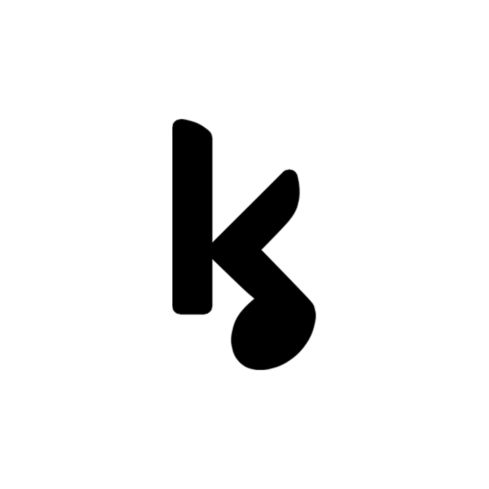

<div align="center">
  

  # Kollab

  **The "GitHub of music" — a music collaboration platform for DAWs.**

  Desktop client built with [Godot Engine 4.3](https://godotengine.org/) · Version `2.3.0`
  Published by **Kollab sound** · [kollabsound.com](https://kollabsound.com)
</div>

---

## Table of Contents

- [Overview](#overview)
- [Features](#features)
- [How it works](#how-it-works)
- [Supported DAWs](#supported-daws)

---

## Overview

**Kollab** is a **music collaboration** platform that brings the Git/GitHub model to audio production: versioning, sharing, and collaborative work on projects.

The idea: a musician creates a project from their DAW file (FL Studio, Ableton Live, Reaper, etc.). As soon as a change is made, they **push** the new version to the server. Invited collaborators **pull** the update and keep working from the latest state of the project — just like a Git commit/pull, but with DAW session files.

Kollab offers two types of projects:

- **Private projects** — shared only with invited members via a share key (UUID), with a number of seats limited by the plan.
- **Public projects** — a community showcase where anyone can browse, **upvote**, **comment on**, and **download** other people's creations.

---

## Features

### Collaboration & versioning
- Create music projects linked to a DAW file/folder
- **Push / Pull** versions to and from the server
- **Version history** with timestamped backups and restoring a previous version
- Invite collaborators via a **share key** (UUID)
- Member management (list, removal, max seats per project)

### Community & social
- **Public projects**: gallery, sorting by date, **upvotes**, **downloads**
- **Comment system** on public projects (with upvotes on comments)
- **User profiles** with links to social networks (Instagram, Spotify, SoundCloud, X, YouTube, Discord, TikTok, Twitch) + description
- User avatars (randomly assigned at sign-up)

### Application
- **Automatic update** at startup (downloads and installs the new version)
- **Authentication** via Firebase (Google Identity Toolkit) — login / register / reset password
- **License key activation** and a **14-day free trial**
- **Machine linking** for anti-piracy purposes
- **Multilingual** interface (French / English)

---

## How it works

```
┌──────────────┐   push (.7z)   ┌──────────────┐   pull (.7z)   ┌──────────────┐
│  Musician A  │ ─────────────▶ │    Server    │ ◀───────────── │  Musician B  │
│  (FL Studio) │                │  Kollab API  │                │  (FL Studio)   │
└──────────────┘                └──────────────┘                └──────────────┘
       │                        │   Firebase   │                       │
       │ opens the project      │     Auth     │     opens the project  │
       ▼                        └──────────────┘                       ▼
   local DAW                                                       local DAW
```

---

## Supported DAWs

Kollab does not integrate inside DAWs: it **stores the path to their executable** (configured in Settings) and **launches** them on the project file.

| DAW           | Typical extension | Setting          |
|---------------|-------------------|------------------|
| FL Studio     | `.flp`            | `fl_path`        |
| Ableton Live  | `.als`            | `als_path`       |
| Logic Pro     | `.logic`          | `logic_path`     |
| Cubase        | `.cpr`            | `cubase_path`    |
| Reaper        | `.rpp`            | `reaper_path`    |
| Studio One    | `.song`           | `studio_path`    |

---
